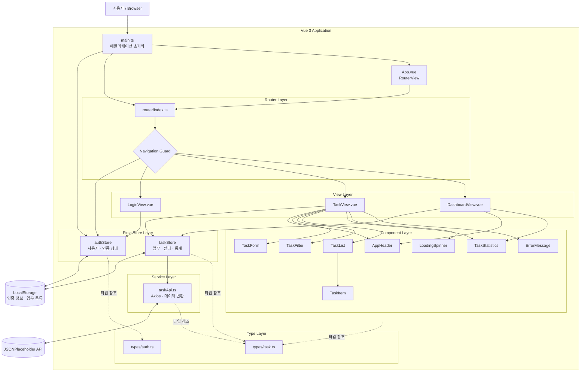
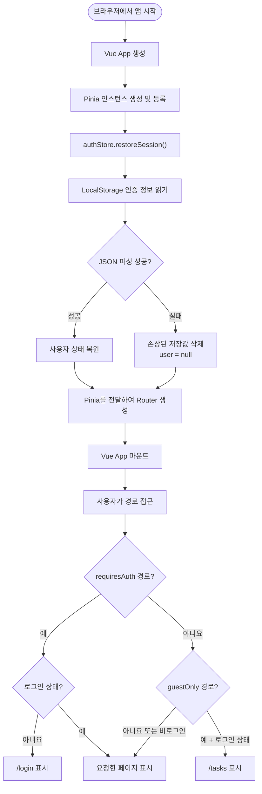
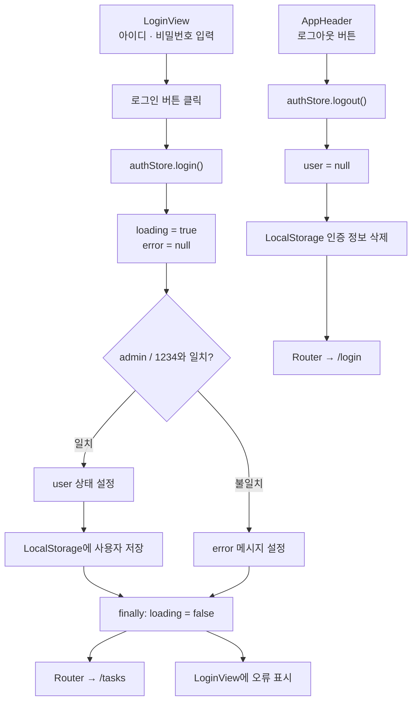
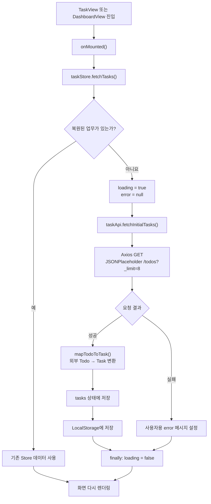
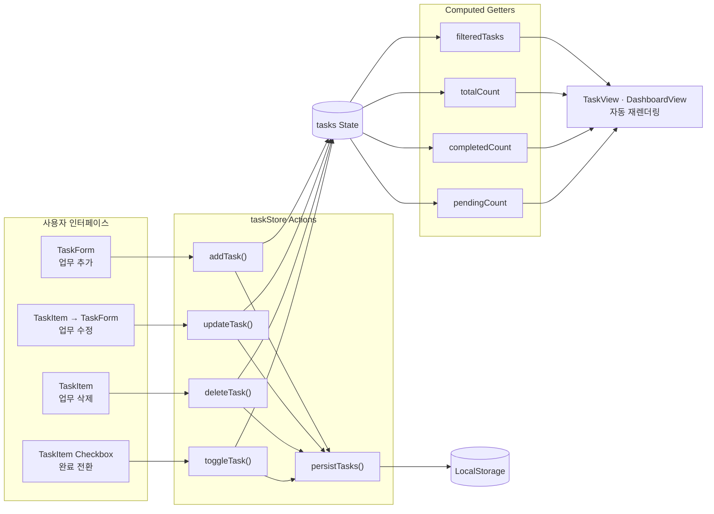
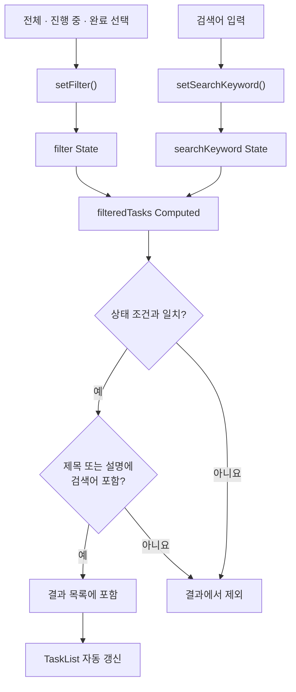
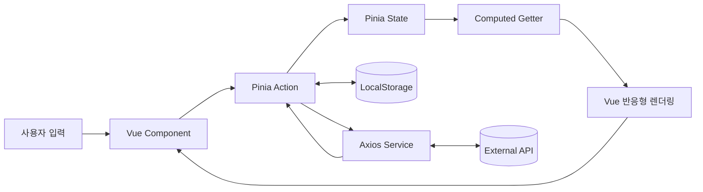

# Pinia Task Manager Architecture

이 문서는 Pinia Task Manager의 전체 구조와 주요 실행 흐름을 텍스트 기반 Mermaid 플로우차트로 설명합니다.

## 1. 전체 시스템 구조



## 2. 애플리케이션 초기화와 인증 라우팅



Pinia를 Router보다 먼저 생성하고 Router 팩토리에 명시적으로 전달합니다. 따라서 Navigation Guard가 실행될 때 활성 Pinia 인스턴스를 안전하게 사용할 수 있습니다.

## 3. 로그인과 로그아웃 흐름



## 4. 초기 업무 조회 흐름



## 5. 업무 CRUD와 반응형 상태 흐름



컴포넌트가 `tasks`를 직접 변경하지 않고 Action을 호출하므로 상태 변경, 비즈니스 규칙, LocalStorage 동기화가 Store 내부에서 함께 처리됩니다.

## 6. 검색과 필터 흐름



## 7. 컴포넌트 구조

```text
App.vue
└── RouterView
    ├── LoginView.vue
    │   └── 로그인 Form
    │
    ├── TaskView.vue
    │   ├── AppHeader.vue
    │   ├── TaskStatistics.vue
    │   ├── TaskForm.vue
    │   ├── TaskFilter.vue
    │   ├── LoadingSpinner.vue
    │   ├── ErrorMessage.vue
    │   └── TaskList.vue
    │       └── TaskItem.vue × N
    │
    └── DashboardView.vue
        ├── AppHeader.vue
        ├── TaskStatistics.vue
        ├── 완료율 Card
        └── 우선순위별 통계 Card
```

## 8. 파일 및 책임 구조

```text
pinia-task-manager/
├── index.html                  # Vite HTML 진입점
├── package.json                # 의존성 및 실행 스크립트
├── vite.config.ts              # Vite와 Vue 플러그인 설정
├── tsconfig*.json              # TypeScript 설정
├── README.md                   # 설치, 실행 및 주요 개념
├── Architecture.md             # 시스템 구조와 실행 흐름
└── src/
    ├── main.ts                 # Vue, Pinia, Router 초기화
    ├── App.vue                 # 최상위 RouterView
    ├── style.css               # 전역 및 반응형 스타일
    ├── router/
    │   └── index.ts            # 라우트 정의와 인증 Guard
    ├── stores/
    │   ├── auth.ts             # 로그인, 로그아웃, 세션 복원
    │   └── task.ts             # 업무 State, Getter, Action
    ├── services/
    │   └── taskApi.ts          # Axios 요청과 데이터 변환
    ├── types/
    │   ├── auth.ts             # User 타입
    │   └── task.ts             # Task, Filter, Input 타입
    ├── views/
    │   ├── LoginView.vue       # 로그인 페이지
    │   ├── TaskView.vue        # 업무 CRUD 페이지
    │   └── DashboardView.vue   # 업무 통계 페이지
    └── components/
        ├── AppHeader.vue       # 내비게이션과 로그아웃
        ├── TaskForm.vue        # 업무 추가와 수정
        ├── TaskFilter.vue      # 검색과 상태 필터
        ├── TaskList.vue        # 업무 목록 및 빈 상태
        ├── TaskItem.vue        # 단일 업무 표시와 조작
        ├── TaskStatistics.vue  # 전체, 진행 중, 완료 개수
        ├── LoadingSpinner.vue  # 비동기 로딩 상태
        └── ErrorMessage.vue    # API 오류와 재시도
```

## 9. 핵심 데이터 흐름 요약



기본 데이터 흐름은 `사용자 입력 → 컴포넌트 → Pinia Action → State → Getter → 화면`입니다. 영속성이 필요한 상태는 Action에서 LocalStorage와 동기화하며, 외부 데이터는 Service 계층을 통해 Task 타입으로 변환한 뒤 Store에 저장합니다.
